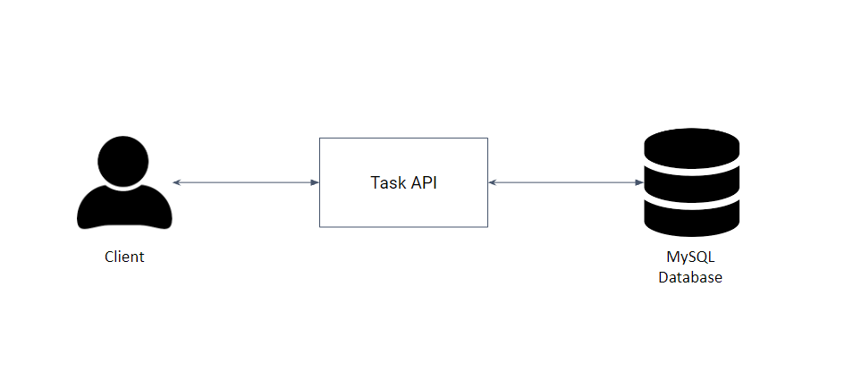
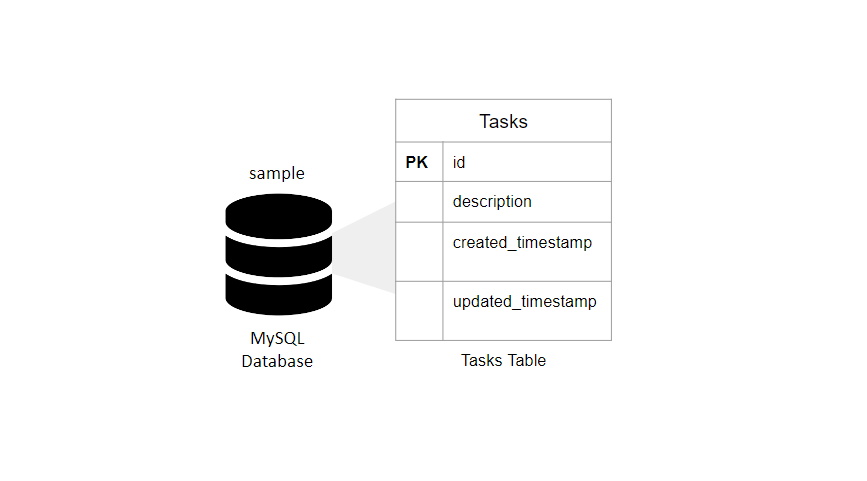
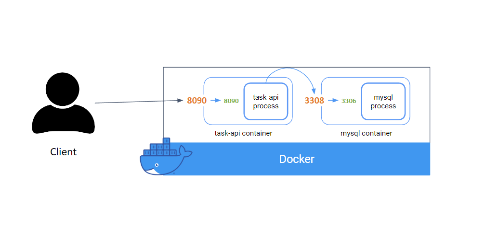

# Golang API Example
A golang containerized API example

[Golang API Example Google Slide Presentation (work in progress)](https://docs.google.com/presentation/d/1IvqOztsqfHIdfXBLD_MNHtTar69yPiqVp456wNPTj4A/edit?usp=sharing)
## Table of Contents

- [Documentation](#documentation)
- [Prerequisites](#prerequisites)
- [Getting Started](#getting-started)
- [Contributing](#contributing)

## Documentation
Technologies used:
- Golang: API via gin 
- MySQL: Database that holds the Task data
- Docker: containerize the API and Database for local development

For local development, we use Docker to containerize the API and MySQL database

## Prerequisites 

- Install Go
    - via Chocolately for Windows
    - via Homebrew for Mac
- Install Docker
    - via Chocolately for Windows
    - via Homebrew for Mac
- (Optional) Install [Docker VSCode Extension](https://marketplace.visualstudio.com/items?itemName=ms-azuretools.vscode-docker). Helps with Syntax highlighting and autocompletion. 

## Getting Started

- Clone repo
- Run `make start` at the top level directory to build and run the API and MySQL docker containers
- Other make targets:
    - `make stop`: stops and removes the docker containers
## Contributing

Some of the plans I have for this repo are documented here in [GitHub Projects](https://github.com/users/codeherk/projects/1).

We appreciate feedback and contribution to this repo! Feel free to create a PR with your changes. I plan to add additional things like a PR template, etc. to make the contribution process more formal.  

